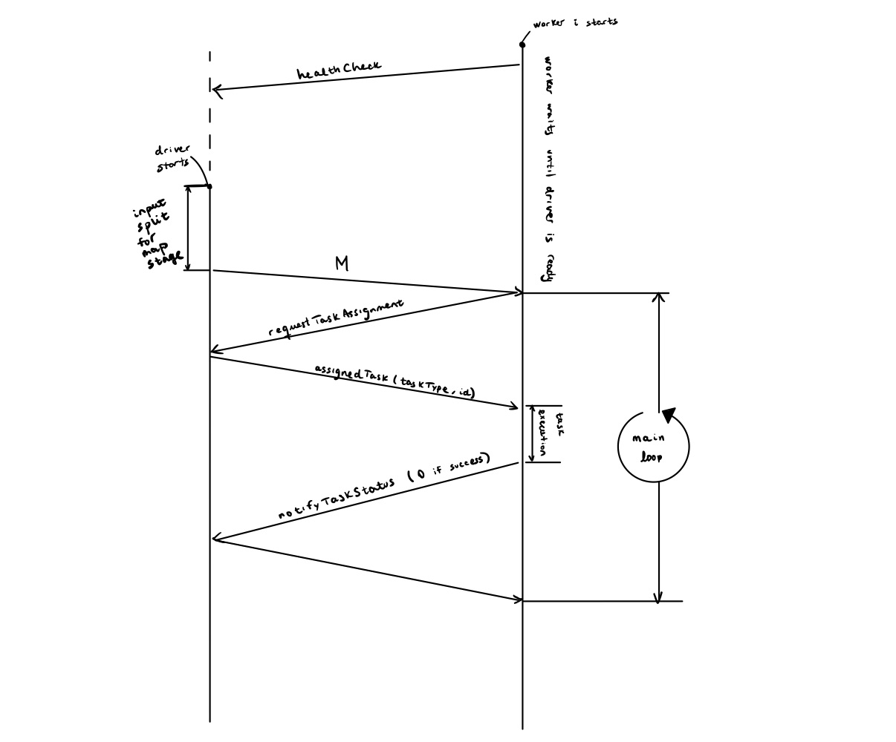

# Mapreduce
Distributed map-reduce program that takes a set of plain text files as an input and produces a count indicating how many times each word occurs in the whole dataset.

## Requirements
- Python >= 3.9.x

## Diagram


> **Note 1** When map tasks are still running, the driver doesn't assign any reduce task. In this case `requestTaskAssignment` returns an `assignedTask` with id=-1.

> **Note 2** When all tasks are completed `requestTaskAssignment` returns an `assignedTask` with id=-2. When the worker receives this assignment, it proceeds to quit. The driver will wait for 5 seconds after this and it will quit. In the meantime, the rest of the workers will have time to get notified about the job's completion.

## How to run a job on a set of files
1. Place all the input files in a new directory `$input_dir`.
2. Set up a virtual environment and install the requirements:
    ```bash
    $ cd $repo
    $ python -m venv $venv_path
    $ source $venv_path/bin/activate
    $ pip install -r requirements.txt
    ```
3. Start as many workers as desired:
    ```bash
    $ python worker.py
    ```
4. Start driver:
    ```bash
    $ python driver.py -N $n_map_tasks -M $n_reduce_tasks $input_dir
    ```

    > **Note** Worker instances can also be started after the driver has been launched.
5. Once the process has terminated, check the result in the `.tmp/out/`.


## How to run tests
```bash
$ cd $repo
$ python3 -m venv $venv_path
$ source $venv_path/bin/activate
$ pip install -r requirements.txt
$ pip install pytest
$ pytest
```

## How to recompile proto files

`compile-protos.sh` must be called whenever changes are made to any of the proto files in the `protos/` directory. This will produce new `*_pb2*.py` files.
